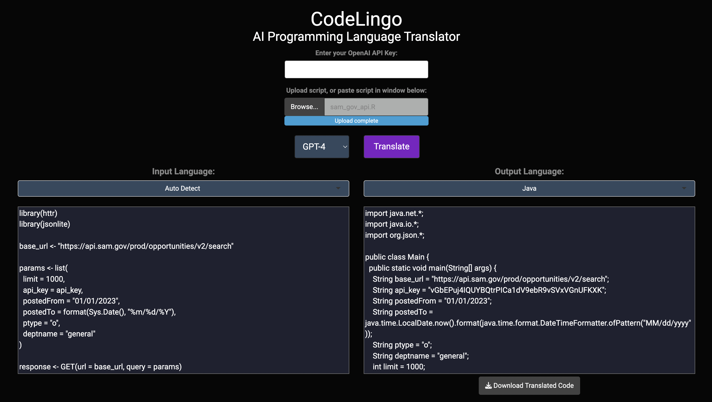

# CodeLingo AI Programming Language Translator

CodeLingo is an AI Programming Language Translator that uses the OpenAI GPT models to translate code between various programming languages.

## Features

- Upload code files or paste code directly into the input area
- Auto-detection of input language (optional)
- Support for multiple input and output languages
- Download translated code as a file

## Prerequisites

- R and RStudio
- Shiny, shinythemes, httr, jsonlite, and shinyjs R packages

## Usage

1. Clone the repository:
   `git clone https://github.com/aousabdo/codelingo`
2. Open the `app.R` file in RStudio or another R IDE.
3. Install the required packages if you haven't already: 
    `install.packages(c("shiny", "shinythemes", "httr", "jsonlite", "shinyjs"))`
4. Run the `app.R` file in RStudio or your R IDE.
5. Enter your OpenAI API key in the designated field.
6. Upload a code file or paste your code directly into the input area.
7. Select the input and output programming languages.
8. Click the "Translate" button to translate your code.

The translated code will appear in the output area. Click the "Download Translated Code" button to download the translated code as a file.

## Supported Programming Languages
- R
- Python
- Scala
- Ruby
- JavaScript
- Java
- C++
- C#
- C
- Go
- PHP
- Matlab
- TypeScript
- TSX
- Perl
- Julia
- SAS
- Assembly Language

## Notes
- The AI translation may not be perfect, and manual adjustments might be required.
- This application requires an OpenAI API Key, which you can obtain by signing up for an account at [https://www.openai.com](https://www.openai.com).

## License

This project is licensed under the [MIT License](https://github.com/git/git-scm.com/blob/main/MIT-LICENSE.txt).

